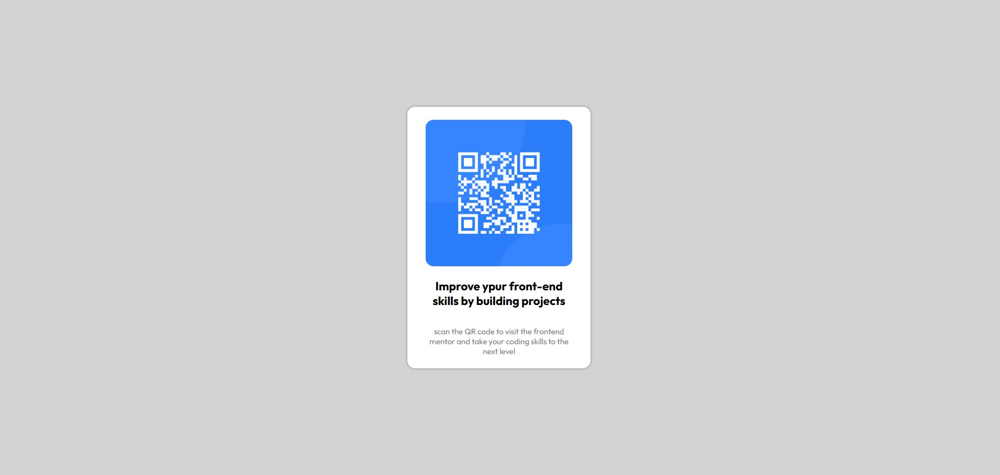

# Frontend Mentor - QR code component solution

This is a solution to the [QR code component challenge on Frontend Mentor](https://www.frontendmentor.io/challenges/qr-code-component-iux_sIO_H). Frontend Mentor challenges help you improve your coding skills by building realistic projects. 

## Table of contents

- [Frontend Mentor - QR code component solution](#frontend-mentor---qr-code-component-solution)
  - [Table of contents](#table-of-contents)
  - [Overview](#overview)
    - [QR code component solution](#qr-code-component-solution)
    - [Links](#links)
  - [My process](#my-process)
    - [Built with](#built-with)
  - [Author](#author)

## Overview

### QR code component solution

### Links

- Solution URL: [QR Code Component Code](https://github.com/Top-Trekx-Im-gvp-98/git-test)
- Live Site URL: [QR Code Component website ](https://im-gvp-qr-code-componet.netlify.app/)

## My process

### Built with

- Semantic HTML5 markup
- CSS custom properties
- Flexbox

## Author

- Frontend Mentor - [@Govardhan VP](https://www.frontendmentor.io/profile/Top-Trekx-Im-gvp-98)

